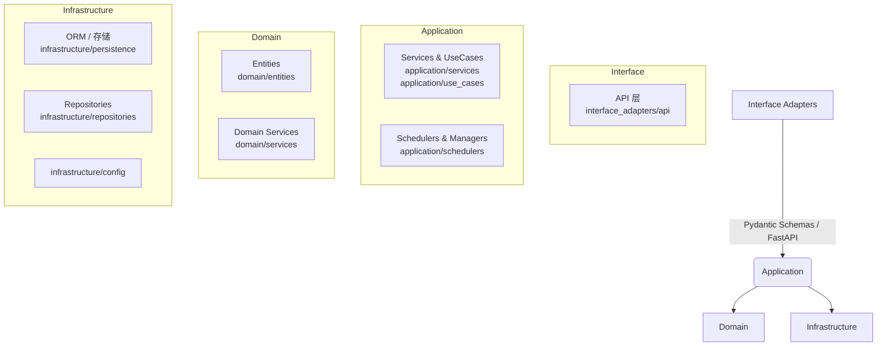
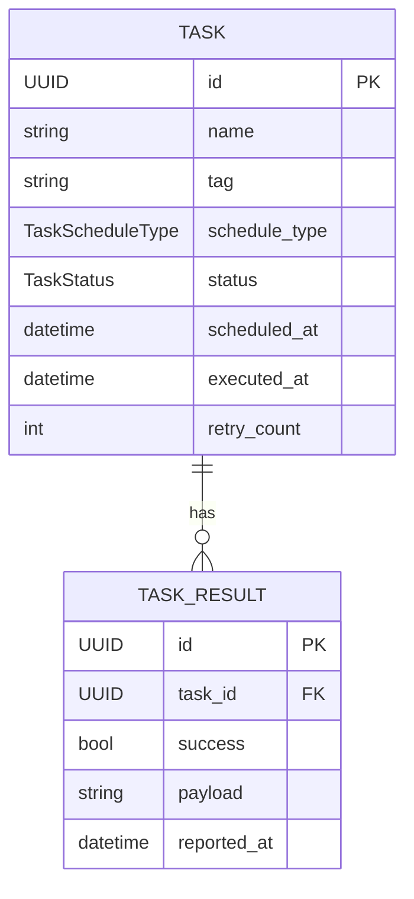
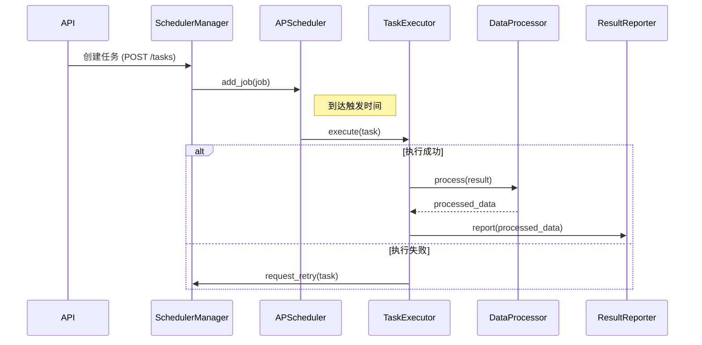

# APScheduler-Demo 说明文档

> **语言**：本 README 以中文撰写，英文版本请参阅 `README_en.md`。  
> **目标读者**：本仓库的使用者、二次开发者以及架构师。  

---

## 目录
1. [项目简介](#项目简介)  
2. [核心特性](#核心特性)  
3. [整体架构](#整体架构)  
4. [数据架构](#数据架构)  
5. [业务流程](#业务流程)  
6. [部署与启动](#部署与启动)  
7. [开发指南](#开发指南)  
8. [扩展指南](#扩展指南)  
9. [目录结构](#目录结构)  
10. [测试策略](#测试策略)  
11. [FAQ](#faq)  

---

## 项目简介
本项目基于 **[APScheduler](https://apscheduler.readthedocs.io/)** 实现了一套可插拔、可扩展的任务调度系统，提供了与 Confluence、Jira、Mattermost 等外部系统数据交互与结果汇报的完整示例。  
系统采用 **Clean Architecture + DDD** 的分层设计，核心优势是**解耦性**与**可测试性**。

---

## 核心特性
- **多调度器支持**：支持 Date / Interval / Cron 等任意 APScheduler 触发器；  
- **任务生命周期管理**：统一处理排队、执行、重试、超时、结果记录；  
- **依赖注入容器**：`application/di_container.py` 释放组件耦合，方便替换实现；  
- **统一异常屏障**：`ErrorHandler` 捕获并转换各层异常，保证 API 稳定；  
- **结果汇报**：内置多种 `DataProcessor` 与外部系统对接；  
- **Docker 一键部署**：提供多阶段 `Dockerfile` 及 `docker-compose.yml`；  
- **100% 单元测试覆盖示例**：见 `tests/unit`；  

---

## 整体架构
项目遵循典型 Clean Architecture 四象限分层，如下图所示：



- **Interface Adapters**：HTTP / CLI / gRPC 等最外层适配器；本项目仅示例了 API 模块。  
- **Application**：编排用例、事务性逻辑、调度器与管理器。  
- **Domain**：纯粹的业务规则，不依赖任何外部框架。  
- **Infrastructure**：与外部世界交互（数据库、第三方 API、消息队列）。  

---

## 数据架构
核心数据结构见 `domain/entities/models.py`。下图展示 ER 关系（省略部分字段）：



- **Task**：调度单元，包含调度类型（立即、定时、Cron）、优先级和重试计数等。  
- **TaskResult**：执行结果快照，与 Task 一对多。  

数据默认存储至 **SQLite**（演示环境），可通过实现 `TaskRepository` / `TaskResultRepository` 适配其他数据库。

---

## 业务流程
以下序列图以「Cron 定时任务」为例展示核心流程：



**重试 / 超时 / 依赖管理** 由 `application/schedulers/managers` 下各 Manager 协同完成。

---

## 部署与启动
### 1. 本地环境 (Poetry / venv)
```bash
# 创建虚拟环境并安装依赖
python3 -m venv .venv && source .venv/bin/activate
pip install -r requirements.txt
# 运行示例脚本
python examples/jira_example.py
```

### 2. Docker
```bash
docker compose up --build
```
默认启动 APScheduler 及一个示例任务，可通过日志观察执行。

---

## 开发指南
1. **依赖注入**  
   通过 `DIContainer` 获取系统组件，避免直接 `import` 实现。示例：
   ```python
   container = DIContainer(config)
   jira_service = container.get_jira_service()
   ```

2. **添加新的 Use-Case**  
   - 在 `application/use_cases` 创建 `foo_use_case.py`，编写执行业务逻辑；  
   - 在 `di_container.py` 暴露工厂方法；  
   - 在 API 层（或 Scheduler）调用；  

3. **调度任务开发**  
   - 新建 `FooTaskManager` 继承 `ScheduledTaskManager`；  
   - 在 `SchedulerManager` 中注册；  
   - 若需自定义触发器，参考 APScheduler 文档；  

4. **异常处理**  
   - 自定义异常放置于 `domain/exceptions.py`；  
   - 在 `ErrorHandler._get_handler` 注册对应处理器；  

---

## 扩展指南
| 需求 | 步骤 |
|------|------|
| **接入新外部系统** (如 Slack) | 1. `integration/external_clients` 下新增 `slack_service.py`<br>2. 在 `domain/services` 创建 `slack_data_processor.py`<br>3. 在 `di_container.py` 注册对应工厂 |
| **替换持久层** | 1. 实现 `TaskRepository` / `TaskResultRepository` 新版本<br>2. 适配 `persistence.py` 提供连接<br>3. 修改 `config.yaml` 指向新仓储类型 |
| **多进程/分布式调度** | 1. 将 APScheduler Executor 换为 `ProcessPoolExecutor` / `AsyncIOExecutor`<br>2. 或使用 Redis / SQLAlchemyJobStore 做持久化<br>3. 部署多实例 + 锁机制 |
| **监控 & metrics** | 1. 集成 `prometheus_client` 输出指标<br>2. 编写 `Middleware` 收集任务时延 |

---

## 目录结构
```text
.
├── application/            # 应用服务层
│   ├── schedulers/         # 调度相关
│   ├── services/           # 应用服务
│   └── use_cases/          # 用例编排
├── domain/                 # 领域层
│   ├── entities/           # Entity / ValueObject
│   ├── services/           # Domain Service
│   └── exceptions.py
├── infrastructure/         # 基础设施实现
│   ├── repositories/
│   └── persistence/
├── interface_adapters/     # 适配器 (API / CLI)
├── integration/            # 第三方系统客户端
├── tests/                  # 单元 & 集成测试
└── scripts/                # 项目脚本
```

---

## 测试策略
- **单元测试**：位于 `tests/unit`，使用 **pytest** + **pytest-mock**；  
- **覆盖率**：可运行 `pytest --cov` 查看；  
- **端到端**：可通过 docker-compose 搭建完整环境后模拟请求；  

---

## FAQ
**Q1:** APScheduler 支持热更新任务吗？  
**A:** 支持。调用 `Scheduler.add_job` 时若 `replace_existing=True` 即可覆盖。  

**Q2:** 如何在任务中注入数据库连接？  
**A:** 通过 `DIContainer.get_persistence_manager()` 获取，并在任务函数签名中注入。  

---

> © 2025  apscheduler-demo Contributors. Licensed under the MIT License.
