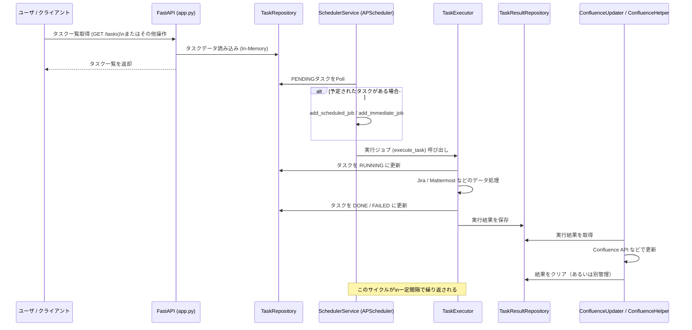

以下は、Mermaid 図の `<br>` タグを削除・置換し、正しく描画できるように修正した README のサンプルです。Markdown 上で Mermaid に対応した環境(GitHub、VS Code の拡張機能など)でプレビューすると、図を視覚的に確認できます。

---

# My Scheduler App - README

ようこそ **My Scheduler App** へ。これは **APScheduler** と **FastAPI** を活用したタスクスケジューリング・フレームワークのサンプル実装です。Jira や Confluence などの外部サービスとの連携例も含まれ、柔軟かつ拡張可能な仕組みを提供します。以下では機能概要、使用方法、技術的なポイントを詳しく紹介します。

---

## 目次

1. [概要](#概要)  
2. [特徴](#特徴)  
3. [ディレクトリ構成](#ディレクトリ構成)  
4. [インストール](#インストール)  
5. [設定ファイル (config.yaml)](#設定ファイル-configyaml)  
6. [実行方法](#実行方法)  
7. [主要コンポーネントと機能](#主要コンポーネントと機能)  
   1. [FastAPI アプリケーション (app.py)](#fastapi-アプリケーション-apppy)  
   2. [タスク管理 (scheduler/repository.py, models.py)](#タスク管理-schedulerrepositorypy-modelspy)  
   3. [スケジューリングとサービス (scheduler/service.py)](#スケジューリングとサービス-schedulerservicepy)  
   4. [実行ロジック (scheduler/executor.py)](#実行ロジック-schedulerexecutorpy)  
   5. [タスクの外部取得 (scheduler/fetch_service.py)](#タスクの外部取得-schedulerfetch_servicepy)  
   6. [結果保存と Confluence 更新 (scheduler/task_result_repo.py)](#結果保存と-confluence-更新-schedulertask_result_repopy)  
   7. [Confluence・Jira ハンドラ (handlers/)](#confluencejira-ハンドラ-handlers)  
8. [FastAPI エンドポイント](#fastapi-エンドポイント)  
9. [システム構成図（アーキテクチャ図）](#システム構成図アーキテクチャ図)  
10. [システム業務フロー図](#システム業務フロー図)  
11. [拡張方法](#拡張方法)  
12. [技術的ポイントとベストプラクティス](#技術的ポイントとベストプラクティクス)  
13. [セキュリティと秘密情報の扱い](#セキュリティと秘密情報の扱い)  
14. [ライセンス](#ライセンス)

---

## 概要

**My Scheduler App** は Python 上で実行されるタスクスケジューリング・システムのサンプルです。  
- **APScheduler** を使った定期実行 (cron/interval/date) タスクのスケジュール管理  
- **FastAPI** を使った REST API によるタスク一覧取得  
- **In-Memory Repository** (メモリ上でタスクを管理)  
- **Jira** や **Confluence** 連携 (例示的な機能)  
- **並列実行** (ThreadPoolExecutor)  
- **デモ用** に大量のタスクを自動生成する仕組み (seed_demo_data)  

本アプリでは、タスクを外部ソースから定期的に取り込み、APScheduler によって実行タイミングを制御し、終了後には Confluence や Mattermost へ通知を送る流れをシミュレーションしています。

---

## 特徴

1. **APScheduler 統合**  
   - スレッドプール(デフォルトで最大 5 〜 500)を用いてタスクを並列実行  
   - cron 式に基づくタスクや、一度きりの即時タスクを柔軟にスケジューリング

2. **FastAPI ベースの REST API**  
   - タスク一覧やタスク履歴を確認するエンドポイントを提供  
   - 必要に応じて追加のエンドポイントを容易に拡張可能

3. **リポジトリパターン**  
   - `TaskRepository` でタスクを一元管理  
   - 現在はメモリ上で保存し、簡単に置き換え可能(例: SQLAlchemy, Redisなど)

4. **外部 API 連携サンプル**  
   - `handlers/confluence_helper.py` / `jira_helper.py` を活用し、Confluence / Jira API へアクセス  
   - 表のパース・更新、Issue 操作などの例示的実装

5. **拡張しやすいアーキテクチャ**  
   - タスク追加方法や実際の処理内容を別クラスで分離 (fetch_service, data_processor など)  
   - エンタープライズ向けにカスタマイズしやすい設計

---

## ディレクトリ構成

```
handlers/
  ├─ confl_handler.py
  ├─ confluence_helper.py
  ├─ jira_handler.py
  └─ jira_helper.py
scheduler/
  ├─ __init__.py
  ├─ config.py
  ├─ confluence_data_processor.py
  ├─ executor.py
  ├─ fetch_service.py
  ├─ jira_data_processor.py
  ├─ mattermost_data_processor.py
  ├─ models.py
  ├─ repository.py
  ├─ schemas.py
  ├─ service.py
  └─ task_result_repo.py
.gitignore
app.py
config.yaml
README.md
requirements.txt
```

---

## インストール

1. **リポジトリを取得**  
   ```bash
   git clone <repository-url> my-scheduler-app
   cd my-scheduler-app
   ```
2. **(任意) 仮想環境を構築**  
   ```bash
   python -m venv venv
   source venv/bin/activate  # Windows: venv\\Scripts\\activate
   ```
3. **依存パッケージのインストール**  
   ```bash
   pip install -r requirements.txt
   ```

---

## 設定ファイル (config.yaml)

```yaml
scheduler:
  poll_interval: 30      # DBをポーリングして新規タスクを検出する間隔(秒)
  concurrency: 500       # ThreadPoolExecutor のスレッド数
  coalesce: false        # タイミングが重複した場合のジョブ coalescing
  max_instances: 5       # 同一ジョブが同時に実行できる最大インスタンス数
log:
  level: INFO            # ログレベル (DEBUG, INFO, WARN, ERROR, CRITICAL)
  filename: logs/app.log # ログ出力先ファイル
  max_bytes: 10485760    # ログファイルの最大バイト数 (10 MB)
  backup_count: 5        # ログファイルのローテーション数
  format: \"%(asctime)s - %(name)s - %(levelname)s - %(message)s\"
```

---

## 実行方法

```bash
python app.py
```

- アプリ起動時に以下の処理が行われます:
  1. **設定ファイルの読み込み**  
  2. **ロギングのセットアップ**  
  3. **リポジトリの初期化** (デモタスクが 1500 件ほど生成される)  
  4. **APScheduler の起動** (定期ジョブやポーリングジョブが登録される)  

起動後は **http://localhost:8000/** (デフォルト) で FastAPI アプリを利用できます。

---

## 主要コンポーネントと機能

### 1. FastAPI アプリケーション (app.py)

- **create_app()** で以下を行います:
  - `load_config()` で `config.yaml` を読み込み、APScheduler とロギングを設定。  
  - `TaskRepository` (In-memory) と `SchedulerService` をインスタンス化。  
  - **イベントフック**  
    - `startup`: `seed_demo_data()` でタスクを投入し、スケジューラを開始。  
    - `shutdown`: スケジューラを停止。  
  - **ルーティング**  
    - `/tasks`: すべてのタスクを取得  
    - `/tasks/status/{status}`: 指定ステータスのタスクを取得  
    - `/task_history`: 実行済みタスク一覧を取得  

### 2. タスク管理 (scheduler/repository.py, models.py)
- **`models.py`**  
  - `Task`: Pydantic で定義したタスクモデル  
    - `id`, `name`, `task_type`, `cron_expr`, `status`, `created_at`, `updated_at` など  
    - `update_status()` でステータス変更時に `updated_at` を更新  

- **`repository.py`**  
  - `TaskRepository`: タスクを `List[Task]` で保持し、CRUD メソッドを提供  
  - `seed_demo_data()`: 大量のデモタスク(約 1500)を一括登録  

### 3. スケジューリングとサービス (scheduler/service.py)
- **`SchedulerService`**  
  - `BackgroundScheduler` を生成し、ジョブを管理するクラス  
  - **重要なジョブ**:
    1. **poll_db_for_new_tasks**: `poll_interval` 秒ごとに実行  
       - リポジトリから `PENDING` タスクをチェックし、  
         - `scheduled` タスク (cron_expr あり) → APScheduler の cron ジョブとして追加  
         - `immediate` タスク → date トリガー(即時) ジョブとして追加  
       - タスクステータスを `SCHEDULED` や `QUEUED` に更新。  
    2. **read_data**: CronTrigger (`* * * * *`) で毎分実行する例示的なジョブ  
    3. **fetch_from_confluence**: CronTrigger で外部からタスクを取得する例示  

  - **add_scheduled_job / add_immediate_job** メソッド:  
    - 実際に APScheduler へジョブを登録し、`executor.execute_task` を呼び出すように設定。  

### 4. 実行ロジック (scheduler/executor.py)
- **`TaskExecutor`**  
  - `execute_task(task_id)`:  
    - 該当タスクを取得してステータスを `RUNNING` → (処理) → `DONE` へ更新するフロー  
    - 例示的に `jira_data_processor` → `mattermost_data_processor` → `confluence_data_processor` を呼び出す。  
    - 処理完了後、`task_result_repo` に結果を保存。  
    - 失敗時はステータスを `FAILED` に変更し、例外をログ出力。  

### 5. タスクの外部取得 (scheduler/fetch_service.py)
- **`ExternalTaskFetcher`**  
  - `fetch_from_confluence()`, `fetch_from_rest_api()` などのメソッドを例示的に定義  
  - 実際にはダミーデータを作成し `task_repository.add_task(...)` する。  
  - 外部 API 連携の実際のロジックを実装する際は、このファイルを拡張する。

### 6. 結果保存と Confluence 更新 (scheduler/task_result_repo.py)
- **`TaskResultRepository`**  
  - タスク実行結果 (`Dict[str, Any]`) をスレッドセーフに保持し、`clear_results()` で消去可能  
- **`ConfluenceUpdater`**  
  - `update_confluence()` はダミー実装だが、実際に Confluence へまとめた結果をアップロードする想定。  

### 7. Confluence・Jira ハンドラ (handlers/)
- **`confluence_helper.py`**  
  - `ConfluenceHelper` クラスが、Atlassian Python API + BeautifulSoup でページ HTML をパースし、表を取得・更新する例示。  
  - **表更新** 時は古い `<tbody>` を置き換えることで表の内容を更新。  
  - 衝突(Conflict) 検知時にはリトライ処理を行う。  

- **`jira_helper.py`**  
  - `JiraHelper` クラスが、Jira API と連携  
    - **search_issues()**: jql を実行して Issue を検索 (fetch_all = True でページングも対応)  
    - **update_issue()**: フィールド名から field_id を逆引きし、Issue を更新  
    - **delete_issue()**: 特定の条件 (`must_have_fields`, `must_not_have_fields`, `must_status_in`) を満たす場合にのみ Issue を削除  

- **`confl_handler.py`, `jira_handler.py`**  
  - それぞれの `helper` を呼び出す簡易スクリプト。実際のアプリには未組み込みですが、動作例として残されている。

---

## FastAPI エンドポイント

1. **`GET /tasks`**  
   - 全タスクの一覧を返す (JSON)。  
   - レスポンス例:
     ```json
     {
       "total_count": 1500,
       "data": [
         { "id": 1, "name": "Scheduled Test 1", ... },
         ...
       ]
     }
     ```

2. **`GET /tasks/status/{status}`**  
   - 指定したステータス (PENDING, RUNNING, DONE, FAILED, etc.) のタスクを返す。  
   - レスポンス例:
     ```json
     {
       "total_count": 10,
       "data": [
         { "id": 101, "name": "Immediate Task 1", "status": "PENDING", ... },
         ...
       ]
     }
     ```

3. **`GET /task_history`**  
   - 実行済みタスク (`DONE` または `FAILED`) の履歴を返す。  

現在は「タスクを追加/更新/削除する API」は存在しません。外部から取り込みたい場合は `fetch_service.py` で処理を行います。

---

## システム構成図（アーキテクチャ図）

以下の Mermaid 図は、本アプリの概念的なアーキテクチャを示しています。

```mermaid
flowchart LR
    A[ユーザ\nまたは他のクライアント] -->|HTTP/REST| B(FastAPI\napp.py)
    B --> C[SchedulerService\n(APScheduler)]
    B --> D[TaskRepository\n(In-Memory)]
    C --> D
    C --> E[TaskExecutor\n(executor.py)]
    E --> D
    E --> F[ConfluenceHelper\nJiraHelper など]
    F -->|API| G[Confluence / Jira /\nその他外部サービス]
    E --> H[TaskResultRepository]
    H --> I[ConfluenceUpdater]
    I -->|API| G

    style B fill:#ffd699,stroke:#e38f04,stroke-width:2px
    style C fill:#d3f2e3,stroke:#259d6d,stroke-width:2px
    style D fill:#faf6d5,stroke:#b39b00,stroke-width:2px
    style E fill:#d3e2f2,stroke:#246db0,stroke-width:2px
    style F fill:#f3d1f7,stroke:#a75da7,stroke-width:2px
    style H fill:#f4f4f4,stroke:#ccc,stroke-width:1px
    style I fill:#f4f4f4,stroke:#ccc,stroke-width:1px
```

- **FastAPI (B)**  
  ユーザやクライアントからの REST リクエストを処理し、タスクの一覧取得やタスク実行状況を返します。  
- **SchedulerService (C)**  
  APScheduler を利用し、タスクのスケジューリングとポーリングを担当します。  
- **TaskRepository (D)**  
  タスクのメタデータを保持するインメモリ・リポジトリ。  
- **TaskExecutor (E)**  
  実際のタスクを実行し、必要に応じて外部サービス (F) やリポジトリ (D) を操作します。  
- **ConfluenceHelper / JiraHelper (F)**  
  外部サービス (G) にアクセスし、情報取得や更新を行います。  
- **TaskResultRepository (H)**  
  タスクの実行結果を一時的に保存。  
- **ConfluenceUpdater (I)**  
  まとめられた結果を再度 Confluence などに反映する例示的クラス。

---

## システム業務フロー図

続いて、タスクが新規登録されて実行されるまでの業務フローを簡易なシーケンス図で示します。


```mermaid
sequenceDiagram
    participant USER as ユーザ / クライアント
    participant API as FastAPI (app.py)
    participant REP as TaskRepository
    participant SCH as SchedulerService (APScheduler)
    participant EXE as TaskExecutor
    participant RES as TaskResultRepository
    participant CFX as ConfluenceUpdater / ConfluenceHelper

    USER->>API: タスク一覧取得 (GET /tasks)\nまたはその他操作
    API->>REP: タスクデータ読み込み (In-Memory)
    API-->>USER: タスク一覧を返却

    SCH->>REP: PENDINGタスクをPoll
    alt 予定されたタスクがある場合
        SCH->>SCH: add_scheduled_job / add_immediate_job
    end

    SCH->>EXE: 実行ジョブ (execute_task) 呼び出し
    EXE->>REP: タスクを RUNNING に更新
    EXE->>EXE: Jira / Mattermost などのデータ処理
    EXE->>REP: タスクを DONE / FAILED に更新
    EXE->>RES: 実行結果を保存

    CFX->>RES: 実行結果を取得
    CFX->>CFX: Confluence API などで更新
    CFX->>RES: 結果をクリア（あるいは別管理）

    note over SCH,EXE: このサイクルが\n一定間隔で繰り返される
```

- **1. タスク一覧取得**  
  ユーザが GET `/tasks` を叩くと、FastAPI が `TaskRepository` から取得し返却。  
- **2. PENDING タスクのポーリング**  
  APScheduler が `SchedulerService` 内で一定間隔 (`poll_interval`) ごとに `TaskRepository` をチェック。  
- **3. タスク実行**  
  タスクが見つかると `TaskExecutor` を呼び出し、タスク状態を更新しつつ処理を進める。  
- **4. 実行結果保存**  
  処理結果は `TaskResultRepository` に記録される。  
- **5. Confluence 更新**  
  `ConfluenceUpdater` などが結果を読み出し、Confluence などの外部サービスに反映。  

---

## 拡張方法

1. **リポジトリの差し替え**  
   - 現在の `TaskRepository` はメモリ上で保持しています。  
   - DB (例: Postgres) を使うには、同様のメソッドを持つ新しいクラスを作り `app.py` で差し替えます。  
   - 例: `SQLAlchemyTaskRepository` の `get_task_by_id, add_task, update_task_status` 等を実装。

2. **タスク取得ロジックの追加**  
   - `fetch_service.py` において、任意の REST API やファイル読み込みなどを行い、結果をタスクに変換 → `add_task`。  
   - `SchedulerService` の `scheduler.add_job` で定期実行を設定すれば完了。

3. **タスク実行ロジックの拡張**  
   - `executor.py` の `execute_task` 内で、必要なビジネスロジックを実装可能。  
   - 独自のデータプロセッサを追加し、Confluence / Mattermost / Jira 連携を複雑化できる。

4. **ロギングや認証の強化**  
   - `setup_logging` は `scheduler/config.py` で定義。フォーマッタやログレベルを自由に変更可。  
   - FastAPI の認証( OAuth2 など ) や HTTPS 化などは通常の FastAPI の手法で組み込めます。

---

## 技術的ポイントとベストプラクティクス

1. **並列実行 (ThreadPoolExecutor)**  
   - `config.yaml` の `concurrency: 500` は実行環境に応じて調整推奨。高い数値は大規模・I/O バウンド向け。  
   - CPU バウンドタスクなら小さめ(10〜30程度)を推奨。

2. **APScheduler**  
   - `BackgroundScheduler` はアプリプロセス終了時にジョブを保持しないため、永続化が必要な場合は JobStore(SQLAlchemy, Redisなど) を利用してください。  
   - `coalesce` の設定により、ジョブが遅延実行されたときに同時実行をまとめるかどうかが決定されます。

3. **大量タスク (seed_demo_data)**  
   - デモ用に 1500 タスクが生成されます。メモリ消費・実行効率に注意が必要です。  
   - 本番環境では `seed_demo_data` を削除するか、デフォルト無効化を検討してください。

4. **エラー処理と再試行**  
   - 例外は `executor.py` や各種 `helper.py` でログを出力しつつステータス変更。必要に応じてリトライ (再実行) ロジックを追加可能。  
   - Confluence の表更新ではバージョン衝突を検知し、リトライを実行する例が含まれています。

5. **API 認証・セキュリティ**  
   - 本サンプルでは認証を実装していません。社内システムや本番運用では API キーや OAuth 等を設定し、不要なエンドポイントの公開は控えてください。  
   - Jira / Confluence の認証情報はコードに直接書き込まず、環境変数や安全なストレージから取得するのが望ましいです。

---

## セキュリティと秘密情報の扱い

- **ハードコードされた認証情報に注意**  
  - `handlers/confl_handler.py` や `jira_handler.py` でユーザ名やパスワードを埋め込むのはデモ用です。  
  - 本番では必ず環境変数やシークレットマネージャーを使用し、ソースコードには含めないでください。

- **ログ出力**  
  - タスク内容や機密情報がログに残らないよう適切なマスキングやログレベル管理が必要です。

- **HTTPS**  
  - 本番運用時には FastAPI を HTTPS (リバースプロキシ経由など) で公開し、通信を保護してください。

---

## ライセンス

このコードはデモおよび内部利用を想定したものです。組織のポリシーやライセンス要件を確認し、必要に応じてライセンス文書を追加してください。

---

以上が **My Scheduler App** の機能一覧と技術仕様、そしてシステム構成図・業務フロー図です。  
APScheduler、FastAPI、そして外部サービス(Jira・Confluenceなど)との連携例を示すアプリケーションとしてお役立てください。

カスタマイズや拡張に際し、不明点や追加機能に関するご要望があれば、ぜひご相談ください。

**Happy Scheduling!**