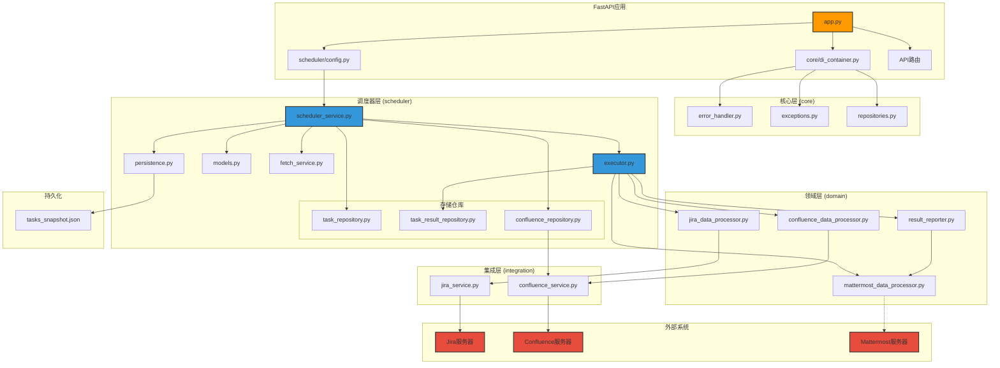
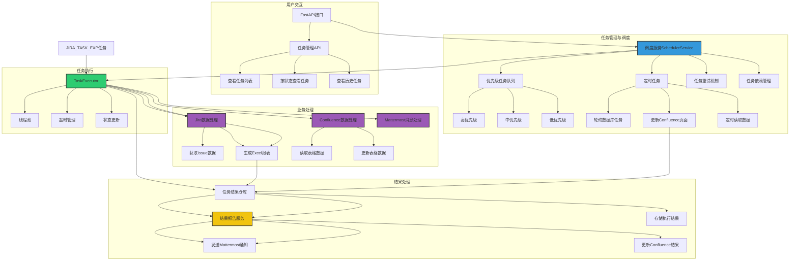

我很乐意帮您创建技术架构图和业务架构图，以可视化您提供的系统文档内容。

## 图表说明

### 系统技术架构图

技术架构图展示了系统的各个技术组件及其关系：

1. **FastAPI应用**：作为整个系统的入口点，包含配置加载、依赖注入和API路由
2. **核心层**：提供基础设施，包括依赖注入容器、错误处理和异常定义
3. **调度器层**：系统的核心，负责任务的调度、执行和管理
4. **领域层**：包含业务逻辑处理，处理Jira、Confluence和Mattermost数据
5. **集成层**：负责与外部系统交互，封装API调用细节
6. **外部系统**：系统需要与之交互的外部服务
7. **持久化**：通过JSON文件实现任务状态的持久化存储

### 系统业务架构图

业务架构图描述了系统的主要业务流程和功能模块：

1. **用户交互**：通过FastAPI提供的API接口查看任务信息
2. **任务管理与调度**：
   - 优先级队列管理（高、中、低）
   - 定时任务（轮询数据库、更新Confluence、读取数据）
   - 任务重试机制
   - 任务依赖管理
3. **任务执行**：通过线程池并发执行任务，管理任务状态和超时
4. **业务处理**：
   - Jira数据处理（获取Issue数据、生成Excel报表）
   - Confluence数据处理（读取和更新表格）
   - Mattermost消息处理
5. **结果处理**：存储执行结果、发送通知、更新到Confluence

这两张图直观地展示了系统的整体架构和业务流程，可以帮助团队更好地理解系统设计和实现。需要对任何部分进行调整或添加更多细节吗？